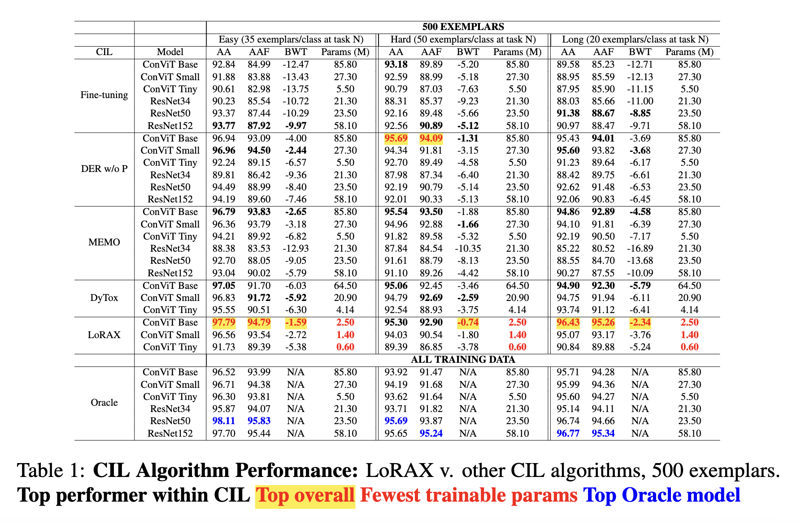

# LoRAX

## LoRAX: LoRA eXpandable Networks for Continual Synthetic Image Attribution


# Installation

Follow the instructions in [installation.md](https://github.com/mit-ll/lorax_cil/blob/main/installation.md).

# Data scenarios 
The CDDB dataset can be downloaded from the repository here: https://github.com/Coral79/CDDB/tree/main?tab=readme-ov-file

1. CDDB Easy
2. CDDB Hard
3. CDDB Long

# Backbone architectures supported
1. ConViT - base, small, tiny

# To run our top performing model
To run our top performing LoRAX model on the 3 CDDB dataset scenarios: 


```
cd LoRAX

for scenario in long easy hard
do
    torchrun main_lorax.py \
    --options "./configs/data/ganfake_"$scenario".yaml" \
    "./configs/data/ganfake_"$scenario"_order.yaml" \
    ./configs/model/ganfake_convit_lorax.yaml \
    --name "lorax_"$scenario"" \
    --data-path PATH_TO_CDDB_DATA \
    --output-basedir PATH_TO_OUTPUT_DIR
done

``` 

The three options refer to config files that specify:
- Hyperparameters for the specific CDDB scenario (easy, long, hard)
- Order of of the tasks for each CDDB scenario
- Hyperparameters for the LoRAX model 

You can find the full set of hyperparameters in `LoRAX/configs/arg_parser.py`. The model config file (`./configs/model/ganfake_convit_lorax.yaml`) will override all arguments passed through the command line.

## Distributed Memory? 
To prevent the distributed versus global memory discrepancy, all of our results are reported for a distributed world size of 1.
https://github.com/arthurdouillard/dytox/blob/main/erratum_distributed.md

# Evaluation Metrics
Each task in the CDDB dataset contains a set of real and synthetic images; consequently, each task in our CIL process results in an additional authentic image class. We employ a multi-real classification scheme that does not penalize for confusion between authentic classes (e.g. an authentic image from task $i$ is classified as an authentic image from task $j; j \ne i$). We calculate our performance metrics in a multi-real setting, such that any classification of an authentic image type as any authentic image type is considered correct.

# Results 
Your results will be stored in the following folder:
`{output_basedir}/logs/ganfake/{model}/{epochs}/{memory_size}/{DATE}_{name}_{scenario}_{r_param}_{reg}_1`

Model checkpoints will automatically be generated at each task and stored in this folder, along with all hyperparameters (config.json) and accuracy metrics at each task (logs_1.json). Accuracy at each task can be accessed with the key 'acc_per_task_remapped' in the logs_1.json dictionary. We automatically generate line plots at the end of each run (plot saved to metrics_plot_1.png) and store the accuracy matrix, bwt, and average accuracy at the final task in metrics_1.txt.

## Our results - 500 Exemplars


### Authors
* Danielle Sullivan (MITLL)
* Nicole Tian (Yale University, MITLL)
* Pooya Khorrami (MITLL)

### Acknowledgements 

The following repos were extremely helpful in our model development process:

* [DyTox](https://github.com/arthurdouillard/dytox)
    * The DyTox repository provided us with code for the continual learning training process, ConViT-based models, and metric reporting.

* [Continual Deepfake Detection Benchmark](https://github.com/Coral79/CDDB)
    * LoRAX results are reported based on the CDDB benchmark. CDDB data loading code was taken from the CDDB repo with minor edits.

* [PyCIL](https://github.com/G-U-N/PyCIL)
    * The code for the baseline models reported in our paper was heavily influenced by the PyCIL repository.

# Disclaimer

DISTRIBUTION STATEMENT A. Approved for public release: distribution unlimited.

© 2024 MASSACHUSETTS INSTITUTE OF TECHNOLOGY
* Subject to FAR 52.227-11 – Patent Rights – Ownership by the Contractor (May 2014)
* SPDX-License-Identifier: MIT

This material is based upon work supported by the Department of the Air Force under Air Force Contract No. FA8702-15-D-0001. Any opinions, findings, conclusions or recommendations expressed in this material are those of the author(s) and do not necessarily reflect the views of the Department of the Air Force.

Delivered to the U.S. Government with Unlimited Rights, as defined in DFARS Part 252.227-7013 or 7014 (Feb 2014). Notwithstanding any copyright notice, U.S. Government rights in this work are defined by DFARS 252.227-7013 or DFARS 252.227-7014 as detailed above.

The software/firmware is provided to you on an As-Is basis.
